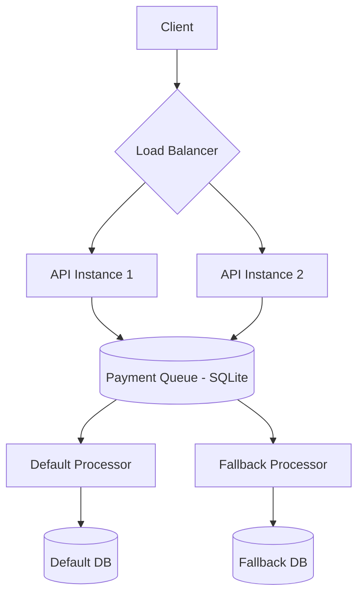
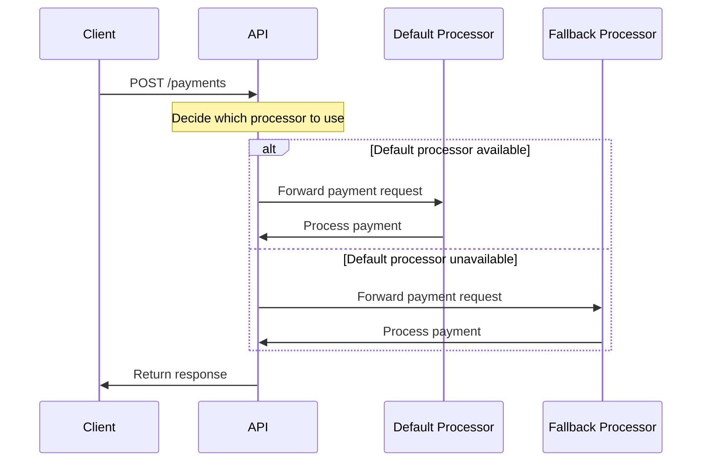

# Rinha de Backend 2025 (WIP)

This project holds the code for my submission for [rinha-de-backend](https://github.com/zanfranceschi/rinha-de-backend-2025), a backend programming competition.

## Running the project

This is an early development version of the project, and everything is still subject to change.

### Quickstart

```bash
# Clone the repository
git clone <repo-url>

# Install dependencies
cd rinha-de-backend-2025
bun install

# Run the project (development)
bun run dev
```

> **Note:** There is still no `docker-compose.yml` file to run the project as a whole. Environment variables for payment processors must be set:
> - `PAYMENT_PROCESSOR_URL_DEFAULT`
> - `PAYMENT_PROCESSOR_URL_FALLBACK`

## Requirements

### Challenge Overview

The Rinha de Backend 2025 challenge requires building a payment processing intermediary that optimizes for cost by routing payments to the most economical processor available. The system integrates with two payment processors:

- **Default processor**: Lower transaction fee, preferred choice
- **Fallback processor**: Higher transaction fee, used when default is unavailable

Both processors experience periodic instability (increased response times or service unavailability). The goal is to process payments as quickly as possible while minimizing fees.

### Architecture



#### System Requirements
- API must be accessible on port **9999**
- At least two instances of the web server
- Total resource limits: 1.5 CPU units and 350MB memory
- Must use "bridge" network mode in Docker

### Endpoints

#### 1. Payment Request
```
POST /payments
```
**Request Body:**
```json
{
    "correlationId": "4a7901b8-7d26-4d9d-aa19-4dc1c7cf60b3",
    "amount": 19.90
}
```
- `correlationId`: Required unique UUID
- `amount`: Required decimal

**Response:**
- Any HTTP 2XX response is valid
- Response body can be anything (even empty)

#### 2. Payments Summary
```
GET /payments-summary?from=2020-07-10T12:34:56.000Z&to=2020-07-10T12:35:56.000Z
```
**Query Parameters:**
- `from`: Optional ISO timestamp in UTC
- `to`: Optional ISO timestamp in UTC

**Response:**
```json
{
    "default": {
        "totalRequests": 43236,
        "totalAmount": 415542345.98
    },
    "fallback": {
        "totalRequests": 423545,
        "totalAmount": 329347.34
    }
}
```

### Payment Processor Integration

The application integrates with two payment processors at:
- Default processor: `http://payment-processor-default:8080`
- Fallback processor: `http://payment-processor-fallback:8080`



#### Key Payment Processor Endpoints

- `POST /payments` (with `correlationId`, `amount`, `requestedAt`)
- `GET /service-health` (returns `{ failing: boolean, minResponseTime: number }`, rate-limited to 1 call per 5 seconds)

### Implementation Notes

- Built with [Bun](https://bun.sh/) and [Elysia](https://elysiajs.com/)
- Uses Bun's built-in SQLite for persistence
- Payment queue and summary are managed in the database
- Payment processor URLs are configured via environment variables
- Payments are processed asynchronously in batches
- No overlapping payment processing jobs (see code for details)

---

For more details, see the code and comments in `src/`.
