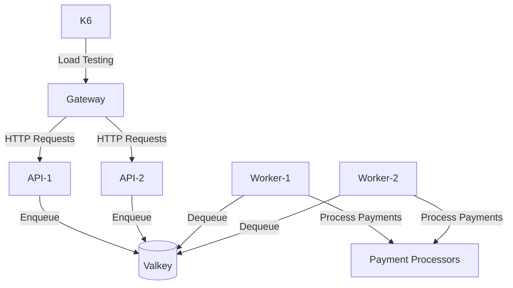
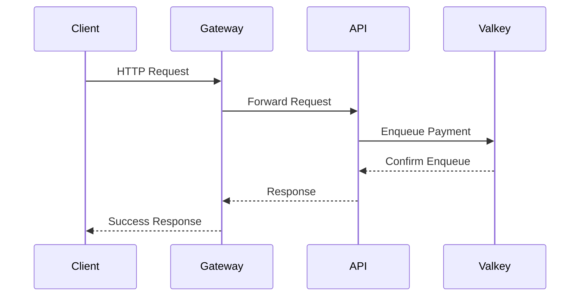
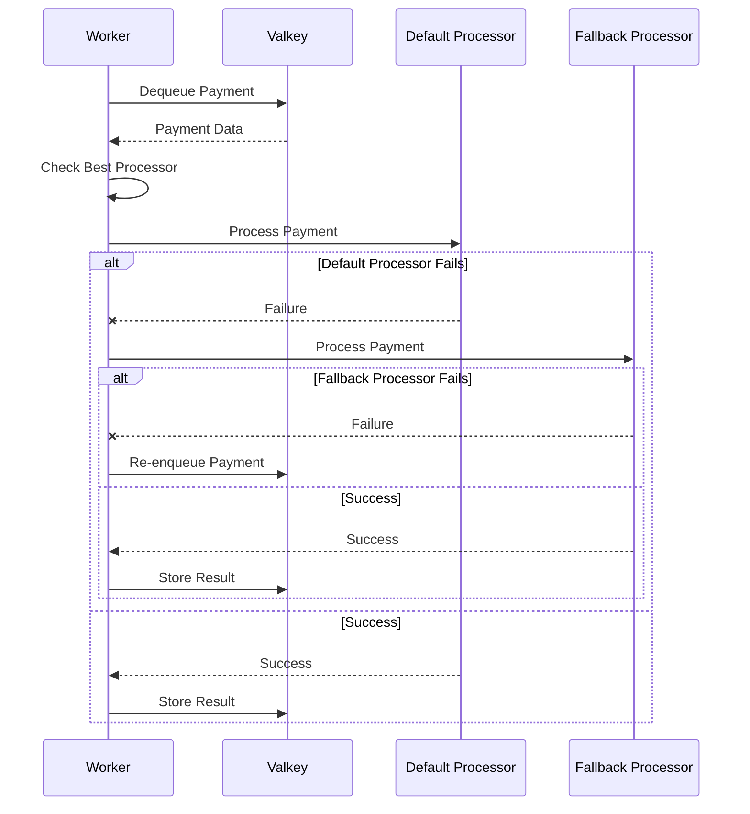
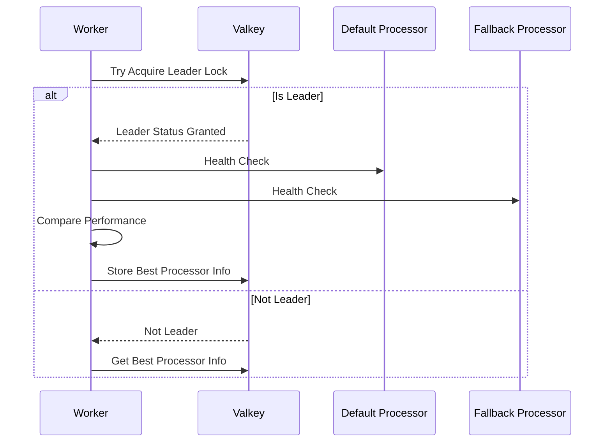

# Elysia

This implementation of the Rinha de Backend 2025 is built using [Elysia](https://elysiajs.com/), a modern and lightweight web framework.

## Architecture

This diagram gives an overview of the architecture:



The pillars of this architecture are separate HTTP requests API from workers that handle payment processing, using Valkey for data storage and queue management, simplifying the overall design.

## Process Flows

### Enqueue Process

The enqueue process is initiated by the client through the API, which forwards the request to Valkey for queuing. This splits the responsabilities between receiving the request and processing it later.



### Dequeue and Payment Processing

The worker retrieves the payment from Valkey, checks which processor to use (given the healthchecks and performance metrics), and processes the payment. If any fail happens, it will reenqueue the payment for later processing.



### Leader Election and Health Check

This is required to ensure that the payment processors do not rate limit health checks and performance metrics. The worker tries to acquire a leader lock from Valkey, and if successful, it performs health checks on the processors and stores the best performing processor information. If not the leader, it retrieves the best processor info from Valkey.



## Building and Running

This project uses the built-in Bun's build system, this increases the performance and lowers the memory footprint of the application. To build and run the project, you can use the following commands:

```bash 
docker compose up --build
```

This will expose the port `9999` to client requests. Check the `/test/` folder on this repository for the K6 load testing scripts.